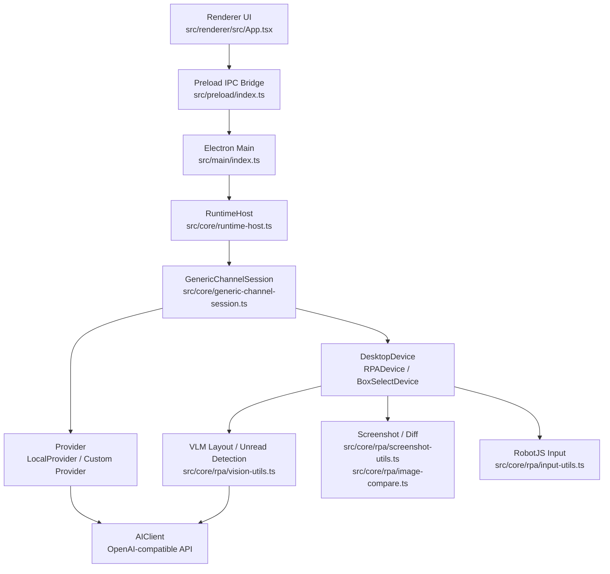
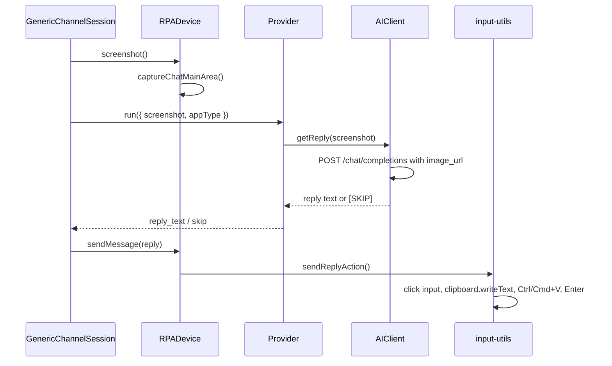

# SightFlow Desktop Agent 项目详细分析报告

分析日期：2026-06-17  
分析对象：`https://github.com/sightflow-dev/sightflow-desktop-agent.git`  
上游分析版本：`main` 分支 `6ada24c8b2a5a5cbf60cebfa54b2730123e4e966`  
上游干净克隆路径：`C:\Users\Administrator\AppData\Local\Temp\sightflow-analysis-1781671588400`  
本地工作区路径：`K:\项目开发\sightflow-desktop-agent-main`

## 1. 总体结论

SightFlow Desktop Agent 当前更准确地说是一个“基于 Electron + VLM 的桌面聊天自动回复/RPA 客户端”。README 中强调的 “Open-Source Working Memory Engine” 是一个更大的产品愿景，但在当前上游代码里，真正落地的核心能力主要集中在：

1. 桌面 IM 窗口识别。
2. 聊天区域截图。
3. 通过视觉模型识别布局、红点、未读联系人。
4. 通过 OpenAI-compatible 接口生成回复。
5. 通过 RobotJS 点击输入框、粘贴回复并发送。
6. 通过 Provider 机制扩展不同模型或回复策略。

项目方向是有价值的，尤其适合继续发展成“桌面自动化客服/私域消息助手/个人工作助理”。但当前架构仍处于早期可运行原型到产品化工程之间的阶段：主链路能跑，代码边界还不够清晰，模型职责混合，观测与容错不足，长期运行成本和稳定性需要继续治理。

一句话判断：

> 这是一个具备可用雏形的桌面 AI-RPA 项目，但还不是稳定成熟的长期自动化平台。下一阶段应优先做模型分层、感知降本、执行层稳定性、结构化日志和可验证测试。

## 2. 仓库与技术栈

### 2.1 基本信息

- 项目名：`sightflow-desktop-agent`
- 类型：桌面端 Electron 应用
- 许可证：Apache-2.0
- 主语言：TypeScript / React
- 构建工具：electron-vite / Vite
- 打包工具：electron-builder
- UI：React 19
- 桌面自动化：`@hurdlegroup/robotjs`
- 截图/图像处理：Electron `desktopCapturer`、Jimp、pixelmatch、pngjs
- 窗口识别：active-win、get-windows、node-window-manager
- 本地配置：electron-store
- 模型协议：OpenAI-compatible `/chat/completions`

### 2.2 代码规模

在排除 `node_modules`、`out`、`dist`、`build` 后，上游仓库主要文件规模约为：

| 类型 | 文件数 | 行数 |
| --- | ---: | ---: |
| `.ts` | 33 | 4951 |
| `.tsx` | 4 | 1318 |
| `.css` | 2 | 947 |
| `.md` | 4 | 499 |
| `.json` | 6 | 13688 |
| `.js` | 2 | 108 |
| `.mjs` | 2 | 50 |
| `.html` | 2 | 33 |

注意：`.json` 行数偏高，主要来自 lock/config 类文件；真正业务代码集中在 `src/core`、`src/main`、`src/renderer`。

### 2.3 主要 npm 脚本

| 命令 | 作用 |
| --- | --- |
| `npm run dev` | 启动开发环境，先构建 main/preload，再启动 renderer dev server 与 Electron |
| `npm run typecheck` | 同时检查 Node 端与 Web 端 TypeScript |
| `npm run lint` | ESLint + Prettier 检查 |
| `npm run build` | 类型检查后执行 electron-vite build |
| `npm run build:win` | 构建并通过 electron-builder 生成 Windows 包 |
| `npm run dev:test-screenshot` | 构建后运行截图测试入口 |
| `npm run dev:test-reply` | 构建后运行发送回复测试入口 |
| `npm run dev:test-switch` | 构建后运行未读切换测试入口 |

## 3. 架构总览

当前项目可以拆成五层：



### 3.1 Renderer 层

入口主要是 `src/renderer/src/App.tsx`。它负责：

- 展示控制面板。
- 管理用户设置。
- 配置 API Key、模型、Base URL。
- 安装/选择 Provider。
- 启动/停止引擎。
- 展示运行日志。
- 打开框选配置向导。

当前 UI 文件较大，后续建议拆分为：

- 设置面板组件。
- Provider 管理组件。
- 引擎控制组件。
- 日志面板组件。
- 模型配置组件。

这样后续增加“视觉模型/回复模型分开配置”“输入速度设置”“运行指标”等功能时，不会继续堆在一个大组件里。

### 3.2 Main 层

`src/main/index.ts` 是当前项目的编排中心，职责非常多：

- 创建主窗口。
- 管理 electron-store 设置。
- 注册 IPC。
- 管理 Provider 安装和列表。
- 启动/停止运行时。
- 创建 RPADevice 或 BoxSelectDevice。
- 测试模型连接。
- 打开截图框选向导。

典型 IPC 包括：

- `settings:getAll`
- `settings:set`
- `provider:installFromUrl`
- `provider:getInstalled`
- `providerHub:getCatalog`
- `providerHub:update`
- `engine:start`
- `engine:stop`
- `engine:status`
- `engine:updateConfig`
- `engine:testConnection`
- `capture:openSetupWizard`
- `capture:getRegions`
- `capture:resetRegions`

判断：`index.ts` 当前是“能跑”的中心，但已经接近职责过载。中期应该把 settings、provider、engine、capture 拆成独立 service。

### 3.3 Runtime 层

核心文件：

- `src/core/runtime-host.ts`
- `src/core/generic-channel-session.ts`
- `src/core/session-types.ts`

`RuntimeHost` 负责：

- 保存运行状态。
- 接收和调度 session event。
- 包装 Provider 调用。
- 输出日志。
- 处理 session 超时。

`GenericChannelSession` 负责状态机：

1. `bootstrap`
2. `measureLayout`
3. `observe_chat`
4. Provider 生成 `reply_text` 或 `skip`
5. 发送回复或跳过
6. 设置聊天基线
7. `check_unread`
8. 检测当前聊天变化或未读红点
9. 必要时点击未读入口并切换会话
10. `wait_retry` 固定延迟后继续

这个状态机是项目最核心的逻辑资产。它的优点是已经把“观察、回复、检查未读、等待重试”串起来了；缺点是状态和观测指标仍比较粗，很多错误只变成日志，缺少结构化统计和策略调整。

### 3.4 Device 层

核心接口：`src/core/device.ts`

当前主要有三种实现：

- `RPADevice`：真实桌面 RPA，面向微信/企微/VLM 流程。
- `BoxSelectDevice`：手动框选区域流程，适合非标准 App。
- `MockDevice`：测试/模拟。

`RPADevice` 聚合了：

- 截图。
- 布局测量。
- 未读检测。
- 当前聊天 diff。
- 点击未读会话。
- 发送消息。

判断：Device 层的方向是对的，它天然适合作为“桌面能力抽象”。后续可以继续拆内部能力，例如 `ScreenshotService`、`VisionLayoutService`、`InputService`、`UnreadDetector`。

### 3.5 Provider 与模型层

核心文件：

- `src/core/ai-client.ts`
- `src/core/local-provider.ts`
- `src/main/provider-bundle.ts`
- `resources/providers/volcengine-ark/provider.bundle.js`
- `docs/provider.md`

上游当前 `AIClient` 同时承担两类任务：

1. 聊天回复：截图 -> 模型 -> 回复文本。
2. 视觉检测：截图 + prompt -> bbox/point 坐标。

这会带来几个问题：

- 回复模型和视觉模型无法独立配置。
- 无法明确判断一个第三方中转站模型到底适不适合做视觉检测。
- 超时、降级、日志、价格统计无法按职责分开。
- 后续想做 OCR、消息抽取、人格学习时，入口会越来越混。

建议：必须拆分为 `VisionModelClient` 和 `ReplyModelClient`，再用一个兼容外壳保留旧调用。这一点本地工作区已经开始做了，但上游原版还没有。

## 4. 核心运行链路

### 4.1 启动链路

用户点击启动后，大致流程是：

1. Renderer 调用 `engine:start`。
2. Main 读取 settings。
3. Main 加载 Provider。
4. Main 根据 appType 和配置选择设备：
   - 微信/企微默认走 `RPADevice`。
   - 通用 App / 手动框选走 `BoxSelectDevice`。
5. 创建 `RuntimeHost`。
6. Runtime 启动 `GenericChannelSession`。
7. Session 先执行 `measureLayout`。
8. 布局识别成功后进入观察/回复循环。

### 4.2 回复链路

上游默认回复链路：



关键问题：回复模型看到的是截图，而不是一个明确的“最新左侧消息文本”。这就是你之前遇到“回复内容和对方发的消息没啥关系”的重要原因之一。

理想链路应该变为：

1. 感知层提取当前聊天区域。
2. 最新消息观察器提取最新消息块。
3. OCR 或 VLM 解析最新消息文本、发送者、方向。
4. 决策层判断是否需要回复。
5. 回复模型只基于结构化上下文生成回复。
6. 执行层负责输入和发送。

### 4.3 未读检测链路

上游 VLM 模式的未读检测大致分两段：

1. `measureLayout` 时通过视觉模型定位：
   - 未读入口区域。
   - 第一个联系人区域。
   - 搜索框。
   - Header。
   - 聊天主区域。
2. 运行时：
   - 先检查当前聊天区域 diff。
   - 再调用 `hasUnreadMessage` 判断未读红点。
   - 检测到未读后，先点击红点入口，再判断当前联系人是否未读，再点击第一个未读联系人。

优点：设计上已经有“先布局定位、后局部判断”的意识。

缺点：

- 依赖 VLM 首次定位准确性。
- 红点策略依赖 UI 颜色和位置，跨版本、缩放、主题时容易漂。
- 手动框选模式 `hasUnreadMessage()` 固定返回 false，因此无法主动切换其他未读会话。
- 当前状态机没有更强的“消息列表扫描/多未读队列”概念。

## 5. 模型与第三方中转站适配分析

### 5.1 当前协议

上游 `AIClient` 使用 OpenAI-compatible `/chat/completions`：

- Header：`Authorization: Bearer <apiKey>`
- Body：`model`
- Body：`messages`
- Body：`thinking: { type: 'disabled' }`
- Body：`stream: false`
- 图片输入：`image_url`，内容是 `data:image/png;base64,...`

### 5.2 401 Unauthorized 的常见原因

你之前遇到的 `API request failed: 401 Unauthorized`，在这个项目里通常来自：

1. API Key 不正确或过期。
2. 第三方中转站要求不同的 Header 或 Key 前缀。
3. Base URL 写错。
4. Base URL 已经包含 `/chat/completions`，代码又拼了一次，导致请求地址不对。
5. 中转站账号没有对应模型权限。
6. 中转站不支持图片输入，但项目按多模态格式发了请求。

上游原版的 URL 拼接是简单的：

```ts
`${baseURL}/chat/completions`
```

如果用户填的是 `https://xxx/v1/chat/completions`，最终就可能变成 `https://xxx/v1/chat/completions/chat/completions`。后续应该做 URL 规范化。

### 5.3 多模态不等于适合做视觉模型

“多模态模型”不一定都适合这个项目的视觉任务。这个项目的视觉任务不是普通看图描述，而是：

- 找输入框坐标。
- 找聊天区域 bbox。
- 找未读红点区域。
- 找联系人列表中的第一个未读联系人。
- 输出严格格式的 bbox/point。

因此模型能力至少要满足：

1. 能接受 `image_url`。
2. 能理解桌面 UI 截图。
3. 能稳定输出坐标或 bbox。
4. 对中文 UI 有较强识别能力。
5. 响应速度不能太慢，最好 5-15 秒内完成关键检测。
6. 对截图尺寸和 base64 payload 有足够限制宽容度。

很多“能看图聊天”的模型，在坐标定位任务上并不稳定。项目应该把模型能力显式分类，而不是只用一个“模型名”解决所有问题。

## 6. 截图与成本分析

当前项目不是每毫秒截图，但它是轮询型架构。

上游默认 `GenericChannelSession` 里有固定 `retryDelayMs = 5000`。也就是说，在没有新事件时，大约每 5 秒会继续检查。检查过程中可能发生：

- 当前聊天区域截图。
- 当前聊天区域 diff。
- 未读红点区域检测。
- 必要时调用 VLM。
- 必要时调用回复模型。

成本分两类：

### 6.1 本地成本

- 截图本身占 CPU/GPU/内存。
- 图像裁剪、diff 占 CPU。
- Electron + desktopCapturer 在长期运行下可能有内存压力。

### 6.2 模型成本

真正贵的是“把截图发给模型”。如果每次都把聊天区域截图发给 VLM 或回复模型，成本会快速上升，尤其是高频轮询、多窗口、多账号场景。

建议的降本方向：

1. 布局识别只在启动、窗口变化、连续失败后重做。
2. 红点检测优先用局部截图 + 本地像素规则。
3. 当前聊天变化优先用 pixel diff。
4. 只有 diff 显示有变化时才调用回复模型。
5. 回复前尽量裁剪最新消息块，而不是整张聊天区。
6. 加 idle backoff：连续无消息时轮询间隔从 5 秒逐渐增加。
7. 加“人工在线/忙碌窗口/指定时间段”限制。
8. 对模型调用做缓存、统计和熔断。

本地工作区已经开始实现部分降本思路，例如轻量指标、局部截图、空闲退避；上游原版还没有完整具备。

## 7. 执行层分析

上游 `src/core/rpa/input-utils.ts` 的发送链路是：

1. 移动鼠标到输入框。
2. 点击输入框。
3. `clipboard.writeText(text)`。
4. `Ctrl/Cmd + V` 粘贴。
5. `Enter` 发送。
6. 额外处理一次 `Ctrl/Cmd + Enter` 和 `Backspace`，用于规避某些输入/发送状态。

优点：

- 快。
- 对中文和特殊字符兼容性好。
- 实现简单。

缺点：

- 会污染用户剪贴板。
- 行为不像真人输入。
- 某些安全软件/IM 可能拦截粘贴。
- 长文本瞬间出现，容易被平台或对方感知为自动化。
- 粘贴失败时缺少细粒度判断。

长期建议：

- 默认 `typing-with-paste-fallback`。
- 正常使用逐字输入。
- 中文、表情、特殊字符失败时回退粘贴。
- 暴露 CPM 输入速度。
- 日志记录 typing/paste/fallback 的成功率和耗时。

本地工作区已经按这个方向做过改造；上游原版仍是粘贴模式。

## 8. Provider 机制分析

Provider 是项目很关键的扩展点。文档 `docs/provider.md` 描述了 Provider 的输入输出：

- 输入：截图、appType、配置等。
- 输出：`thinking`、`reply_text`、`skip`、`error`。

优点：

- 能把“怎么回复”从桌面执行逻辑中拆出去。
- 可以接入不同模型供应商。
- 可以让用户安装自定义 Provider。

风险：

- Provider bundle 是动态加载的代码，本质上有较高权限。
- 如果支持 URL 安装 Provider，需要明确安全边界。
- 当前缺少签名验证、沙箱、权限限制。
- Provider 可以接触截图和配置，涉及隐私和 API Key 安全。

建议：

1. 自定义 Provider 默认只允许本地文件或可信源。
2. 增加 manifest 签名或 hash 校验。
3. Provider 权限声明化，例如是否需要网络、是否需要截图、是否读取配置。
4. UI 安装时明确提示风险。
5. 长期可考虑把 Provider 跑在隔离进程。

## 9. 隐私与安全分析

项目涉及高敏感数据：

- IM 聊天截图。
- 联系人列表。
- 未读消息。
- 用户输入内容。
- API Key。
- 自定义 Provider 代码。

README 中有 local-first 的表达，但当前代码的实际行为是：截图会发送给用户配置的模型服务或第三方中转站。因此用户文档和设置界面必须明确：

> 只要启用云端模型，聊天截图和相关上下文就可能被发送到模型服务商。

建议补强：

1. 首次启动隐私提示。
2. 每个 Provider 显示数据流向。
3. API Key 本地加密存储或调用系统凭据库。
4. 日志避免输出完整回复、完整 Key、完整截图路径。
5. 自定义 Provider 增加风险提示。
6. 支持本地模型模式作为隐私优先方案。

## 10. 当前成熟度判断

| 模块 | 成熟度 | 判断 |
| --- | --- | --- |
| Electron 外壳 | 中 | 基本完整，能启动、构建、打包 |
| UI 设置面板 | 中低 | 功能集中但组件偏大，模型配置还不够分层 |
| Runtime 状态机 | 中 | 主链路清晰，但缺少指标、退避、熔断和更细状态 |
| RPA 执行层 | 中低 | 能点击粘贴发送，但稳定性和真人感不足 |
| 视觉识别 | 中低 | 有布局和红点检测雏形，但强依赖 VLM 准确性 |
| 回复生成 | 中低 | 能基于截图回复，但上下文抽取不足 |
| Provider 扩展 | 中 | 方向很好，但安全边界要补 |
| 测试体系 | 低 | 有手动测试入口，缺少自动化单元/集成测试 |
| 可观测性 | 低 | 日志有，但缺结构化指标 |
| 长期学习能力 | 很低 | 上游基本未实现 |

## 11. 验证结果

在上游干净克隆目录 `C:\Users\Administrator\AppData\Local\Temp\sightflow-analysis-1781671588400` 验证：

### 11.1 TypeScript 检查

命令：

```powershell
npm run typecheck
```

结果：通过。

### 11.2 构建

命令：

```powershell
npm run build
```

结果：通过。

构建时有一个 Vite 警告：

> `vision-utils.ts` 同时被动态导入和静态导入，因此动态导入不会把该模块移动到独立 chunk。

这不是立即阻塞问题，但说明当前模块依赖边界不够干净。后续如果想优化启动性能或拆包，需要重新整理 `vision-utils.ts` 的职责和导入方式。

### 11.3 Lint

命令：

```powershell
npx eslint . --quiet
```

结果：失败，共 116 个 error。

主要类型：

- 大量 `any`。
- 缺少显式函数返回类型。
- CommonJS `require()` 被规则禁止。
- 未使用变量。
- React Hook 规则问题：`App.tsx` 里有组件渲染期间重赋外部变量 `_showToast` 的问题。

另外完整 `npm run lint` 还有大量 Prettier 换行警告，主要是 CRLF 与当前 Prettier 预期不一致。

判断：构建能过，但 lint 没有形成有效质量门禁。建议先统一换行规则，再分批修复 ESLint error。

## 12. 主要问题与风险

### 12.1 模型职责混合

上游 `AIClient` 同时承担回复和视觉检测。长期会导致：

- 第三方模型适配混乱。
- 视觉模型和回复模型不能独立选择。
- 成本无法分账。
- 超时和错误难以定位。

优先级：P0。

### 12.2 回复上下文不明确

回复模型主要看截图，并没有稳定传入：

- 最新消息文本。
- 消息方向。
- 发送者。
- 是否为自己发送。
- 历史上下文摘要。

这会直接导致“回复和对方消息关系不大”。

优先级：P0。

### 12.3 未读切换能力有限

VLM 模式有未读检测和点击逻辑，但依赖布局识别准确性。手动框选模式无法主动切换其他未读会话，因为 `BoxSelectDevice.hasUnreadMessage()` 固定返回 false。

优先级：P0/P1，取决于目标用户是否主要使用手动框选。

### 12.4 轮询截图成本偏高

固定 5 秒轮询在小规模使用可以接受，但长期运行、多账号、多窗口时成本会上升。尤其是模型调用如果跟截图轮询绑定，会产生明显费用。

优先级：P1。

### 12.5 输出动作偏机器人

上游采用剪贴板粘贴发送，稳定但不够自然，也会污染剪贴板。

优先级：P1。

### 12.6 Provider 安全边界不足

自定义 Provider 动态加载能力很强，但安全隔离不足。若将来对外开放生态，这是必须补的。

优先级：P1/P2。

### 12.7 质量门禁不足

`typecheck` 和 `build` 能过，但 `lint` 失败 116 个 error。说明工程规范还没有真正稳定。

优先级：P1。

### 12.8 UI 组件过大

`App.tsx` 集中了大量逻辑，后续继续加设置和指标会越来越难维护。

优先级：P2。

## 13. 与长期目标的差距

你之前提出的长期方向包括：

- 视觉模型和回复模型分开。
- 支持第三方中转站。
- 降低时刻截图成本。
- 学习主人回复习惯。
- 模拟真人输入。
- 更可靠地检测未读和界面变化。
- 针对长期项目重新规划。

上游当前状态与这些目标的差距如下：

| 目标 | 上游状态 | 差距 |
| --- | --- | --- |
| 模型分层 | 未完成 | `AIClient` 仍混合视觉和回复 |
| 第三方中转站 | 部分支持 | OpenAI-compatible 可用，但 URL/能力/错误处理粗糙 |
| 降低截图成本 | 部分意识 | 有 diff，但缺 idle backoff、指标和事件化检测 |
| 学习主人习惯 | 未实现 | 无记忆层、偏好提取、反馈闭环 |
| 真人输入 | 未完成 | 上游仍是剪贴板粘贴 |
| 未读检测 | 部分实现 | VLM 模式有，手动模式弱，稳定性依赖模型 |
| 最新消息理解 | 未完成 | 没有结构化 latest message context |
| 产品化可观测 | 未完成 | 缺成功率、耗时、失败原因、回退统计 |

## 14. 推荐迭代路线

### 阶段一：先把主链路变稳定

目标：让“识别 -> 回复 -> 输入 -> 检查下一条”稳定、可观测、可回退。

建议任务：

1. 拆分 `VisionModelClient` 和 `ReplyModelClient`。
2. 设置页拆出视觉模型和回复模型配置。
3. 修正 Base URL 规范化，兼容 `/v1` 和完整 `/chat/completions`。
4. 增加模型能力标记：`chat`、`vision`、`ocr`。
5. 增加 Provider 测试：文本测试、视觉测试、回复测试分开。
6. 执行层默认改为 `typing-with-paste-fallback`。
7. 增加输入速度配置，默认 280 CPM。
8. 把最新消息观察结果传给回复 Provider。
9. 增加结构化 runtime metrics。

验收标准：

- 模型配置能明确区分视觉/回复。
- API 错误能显示具体原因。
- 回复内容明显围绕最新消息。
- 逐字输入能在微信/企微输入框稳定工作。
- 失败时有 fallback 和日志。

### 阶段二：降低成本，提高感知可靠性

目标：减少无意义截图和模型调用，提升未读检测准确性。

建议任务：

1. 空闲轮询退避：5 秒 -> 8 秒 -> 15 秒。
2. 当前聊天 diff 使用同一轮截图，避免重复截图和旧图误判。
3. 红点检测优先局部截图。
4. 布局缓存失效条件明确化：窗口变化、缩放变化、连续失败。
5. 对未读切换建立状态机：定位入口、激活入口、验证联系人、点击联系人、观察新聊天。
6. 手动框选模式增加可选“联系人列表区域”和“未读标记区域”。
7. 对每轮检测记录耗时、截图次数、模型调用次数。

验收标准：

- 无消息时模型调用次数显著下降。
- 有新消息时能在合理时间内响应。
- 未读切换失败能自恢复或清楚提示。

### 阶段三：把回复质量做成产品核心

目标：从“看图生成一句话”升级为“理解上下文后生成可信回复”。

建议任务：

1. 最新消息块裁剪。
2. OCR 或 VLM 提取最新消息文本。
3. 判断消息方向：自己/对方/系统。
4. 建立短期上下文：最近 N 条消息摘要。
5. 引入“回复前决策”：该不该回、是否需要人工确认、是否缺信息。
6. Provider 输入结构升级：
   - `latestMessage`
   - `conversationSummary`
   - `contactName`
   - `appType`
   - `confidence`
7. 回复模型只负责生成候选回复，不直接决定执行。

验收标准：

- 回复与最新消息强相关。
- 遇到系统消息、自发消息、无法判断场景时稳定 skip。
- 对常见客服/私域场景有可控模板或风格。

### 阶段四：学习主人习惯

目标：做可控的“风格适配”，而不是不可控自我改写。

建议任务：

1. 记录人工最终发送的回复。
2. 抽取回复特征：
   - 长短。
   - 语气。
   - 称呼。
   - 表情使用。
   - 是否追问。
   - 是否直接给结论。
3. 按联系人/场景建立偏好。
4. 生成回复前注入风格提示。
5. 用户可查看和删除学习记录。
6. 重要回复保留人工确认模式。

验收标准：

- 学习结果可解释、可删除、可关闭。
- 不自动学习敏感场景。
- 不让模型自发修改底层策略。

### 阶段五：产品化与部署

目标：让普通用户能安装、启动、配置、排错。

建议任务：

1. 完善用户说明书。
2. Windows 安装包和桌面快捷方式。
3. 首次启动向导。
4. 权限检查：屏幕录制、辅助功能、窗口权限。
5. Provider 市场或可信 Provider 列表。
6. 一键诊断：
   - 模型连接。
   - 视觉能力。
   - 窗口识别。
   - 输入测试。
7. 错误码和排障文档。

验收标准：

- 非开发用户可以跟着向导完成配置。
- 常见报错能直接定位原因。
- 日志可以导出用于排查。

## 15. 推荐优先级清单

### P0：必须优先

1. 模型分层：视觉模型和回复模型分开。
2. 回复上下文结构化：传入最新消息。
3. Base URL 和第三方中转站兼容性修复。
4. 未读检测与当前聊天变化检测修复。
5. 输出模式改为逐字输入 + 粘贴回退。

### P1：稳定性与成本

1. idle backoff。
2. 局部截图。
3. 运行指标。
4. 失败回退策略。
5. lint error 分批修复。
6. Provider 安全提示。

### P2：产品化

1. UI 组件拆分。
2. 设置页体验优化。
3. 用户说明书完善。
4. 安装包、启动项、诊断工具。
5. Provider 市场。

### P3：长期智能化

1. 主人回复习惯学习。
2. 个性化风格记忆。
3. 多模型路由。
4. 本地模型/混合云模型。
5. 半自动人工审核模式。

## 16. 对本地当前工作区的说明

本报告以上游 `main` 干净版本为基准。你当前本地工作区此前已经开始实现一部分长期规划，包括：

- 拆分模型客户端。
- 增加视觉/回复模型配置方向。
- 输出改为逐字输入并保留粘贴回退。
- 输入速度默认改为 280 CPM。
- 增加运行指标。
- 优化截图 diff 和未读检测成本。
- 把最新消息上下文传给回复 Provider。

这些属于本地改进，不应误认为上游原版已经具备。后续建议继续以本地分支为主推进，再按阶段整理成可提交的 commit。

## 17. 最终建议

这个项目值得继续做，但不要马上追求“大而全的自我进化”。正确顺序应该是：

1. 先把自动回复主链路做稳。
2. 再把模型、感知、执行三层边界拆清。
3. 然后降低截图和模型调用成本。
4. 接着提升回复上下文理解。
5. 最后再做主人风格学习。

如果从工程收益看，下一步最值得继续推进的是：

> 把“最新消息观察 + 回复模型 + 执行动作”这条链路做成可观测、可回退、可测试的闭环。

这条链路稳定后，未读切换、模型市场、学习主人习惯才有可靠基础。
