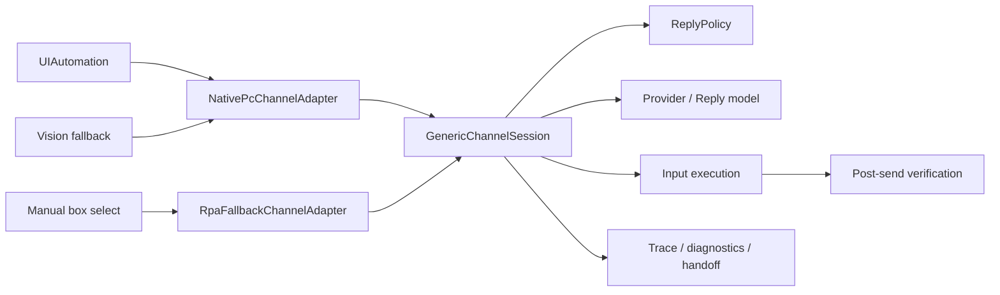

# SightFlow WorkBuddy 开发接手计划

快照日期：2026-07-14  
适用仓库：`sightflow-desktop-agent-main`

## 1. 最终目标

SightFlow 的终局不是单一的微信自动回复脚本，而是一套适配复杂聊天场景的智能客服系统：

- 官方 API 可用时优先走官方通道。
- PC 客户端需要本地能力时走 Native PC Adapter。
- 没有结构化能力时使用 RPA Fallback。
- 所有通道统一进入结构化消息、策略判断、回复生成、执行校验、审计和人工接管闭环。
- 长期产品形态采用“本地桌面代理 + 中央控制后台”，当前仓库先负责桌面代理和本地运行时。

默认安全原则：

- 普通文本和高置信度知识库命中可以自动发送。
- 投诉、退款、法律、医疗、负面情绪、低置信度和未知消息类型转人工或草稿。
- 群聊默认关闭自动回复，仅在明确 `@`、关键词触发或白名单群中开启。
- 图片、语音、文件、转账等特殊消息在识别闭环完成前不得默认自动发送业务结论。

## 2. 当前工程基线

2026-07-14 已实际执行：

| 检查 | 当前结果 |
| --- | --- |
| `npm run typecheck` | 通过，Node 与 Web 均为 0 错误 |
| `npm run test:core` | 11/11 套件通过 |
| `npm run build` | 通过，Electron main / preload / renderer 均成功构建 |
| `npm run acceptance:check` | 55/55 断言通过 |
| `npm run stability:sim` | 8h 模拟、14400 条消息、0 崩溃、0 failed |
| 稳定性延迟 | p99 约 3154ms，平均约 1800ms |
| 稳定性内存 | RSS 增长约 4.1MB |

已修复 Node 24 下稳定性脚本不能直接加载 TypeScript 的问题，`stability:sim` 现在通过 `tsx` 启动。

注意：

- `stability:sim` 是策略和数据层的压缩模拟，不是真实 PC 微信连续运行证明。
- 真机微信、企微、窗口焦点、缩放、弹窗和输入法场景仍需单独验收。
- 当前目录没有可用的 `.git` 元数据，WorkBuddy 接手前应确认上游仓库和提交策略。

## 3. 当前架构状态



核心文件：

| 领域 | 当前文件 |
| --- | --- |
| 通道契约 | `src/core/channel-adapter.ts` |
| PC 与 RPA 适配器 | `src/core/desktop-channel-adapter.ts` |
| 底层桌面设备 | `src/core/rpa-device.ts`、`src/core/box-select-device.ts` |
| 会话编排 | `src/core/generic-channel-session.ts` |
| 消息模型 | `src/core/chat/message-types.ts` |
| 策略与限流 | `src/core/chat/reply-policy.ts` |
| 回复生成 | `src/core/local-provider.ts`、`src/core/model-clients.ts` |
| 审计 | `src/core/automation-trace.ts`、`src/main/diagnostics-service.ts` |
| 运营控制台 | `src/renderer/src/console.tsx` |

## 4. 已完成能力

### 桌面试点主链路

- 微信和企业微信窗口布局测量。
- UIAutomation 优先读取文本消息，失败后回退视觉判断。
- 当前聊天区域差异检测和未读会话切换。
- 回复模型与视觉模型分开配置。
- 逐字输入、粘贴和 fallback 输出模式。
- 空闲轮询退避和连续失败熔断。

### 客服决策

- 私聊自动回复范围控制。
- 群聊关闭、`mention-only`、关键词触发、白名单模式。
- 自发消息跳过、消息去重、回复去重、全局和单会话限流。
- 敏感意图、负面意图、人工客服关键词和知识库低置信度拦截。
- `auto-send`、`draft`、`dry-run` 三种执行模式。

### 产品化骨架

- 本地知识库。
- 人工接管。
- 会话 trace、诊断导出和默认脱敏。
- 设置导入导出、授权、启动前检查和试点文档。
- 发送后视觉差异校验及校验失败熔断。
- 识别链路 stages 已写入 trace，能看到 accessibility / native-structure / ocr / vision 的命中情况。

## 5. 整体进度判断

下面百分比是工程成熟度估算，不是测试覆盖率：

| 能力域 | 进度 | 判断 |
| --- | ---: | --- |
| 单机桌面客服试点 | 72% | 主链路和安全骨架已具备，缺真机长期验证 |
| 私聊纯文本 | 75% | 可试点，仍需真实消息并发和边界测试 |
| 群聊纯文本 | 55% | 策略完整，群类型、群名和 `@` 识别仍不够确定 |
| 特殊消息 | 20% | 类型有预留，缺完整解析、路由和执行策略 |
| 感知管线 | 50% | UIA 和视觉可用，native structure 与 OCR 仍是占位 |
| 执行与发送校验 | 55% | 有执行和 diff 校验，缺消息级发送回执 |
| 审计与人工接管 | 75% | 单机可用，接管状态未持久化和集中同步 |
| 官方 API 通道 | 5% | 仅有 `official-api` 类型，没有实际 Adapter |
| 中央后台和多坐席 | 5% | 当前仍是单机运行时 |
| CRM / 工单双向同步 | 10% | 只有 trace 导出思路，没有双向协议 |
| 主人风格与长期记忆 | 0% | 尚未实现 |

对最终“全聊天场景智能客服”目标的总体进度估算为 **35% 左右**。  
对“单机 PC 微信 / 企微文本客服试点”目标的进度估算为 **70% 以上**。

## 6. 容易误判为完成的能力

WorkBuddy 必须把以下内容视为未完成：

1. `official-api` 目前只是 Adapter kind，不是官方 API 实现。
2. `native-structure` stage 当前记录为 `native_structure_not_configured`。
3. `ocr` stage 当前记录为 `ocr_not_configured`。
4. `RpaFallbackChannelAdapter` 只能处理当前框选会话，`BoxSelectDevice.hasUnreadMessage()` 固定返回 false，不能自动遍历其他会话。
5. UIA 转换默认把未提供类型的会话视为 `direct`，群聊和服务号需要更可靠的 header/context 识别。
6. `LocalProvider` 仍会再次从截图抽取结构化消息，与 Adapter 感知存在重复职责。
7. 发送校验主要依据聊天区域 diff；`missing_baseline` 当前视为通过，不能作为强发送回执。
8. 未读检测仍是轮询，不是真正的事件订阅。
9. 人工接管状态保存在进程内 `Map`，重启后不会恢复。
10. 8h 模拟不覆盖 Electron 截图、微信窗口、RobotJS、输入法和真实模型网络。

## 7. WorkBuddy 实施顺序

必须按下列顺序推进，不要提前做长期记忆、花哨 UI 或中央 SaaS。

### WB-0：锁定接手基线

目标：保证后续每个任务都从可复现的绿色版本开始。

任务：

- 在有 `.git` 的正式工作区确认当前文件来源并创建独立开发分支。
- 执行全部五条基线命令。
- 更新 `CHANGELOG.md`，记录 ChannelAdapter、发送校验和 observation stages。
- 修改 `acceptance-check.mjs`，拒绝使用过期的 `out/stability-report.json`。
- 为 `NativePcChannelAdapter` 和 `RpaFallbackChannelAdapter` 新增纯单元测试。

验收：

- `typecheck / test:core / build / stability:sim / acceptance:check` 全通过。
- acceptance 输出明确显示稳定性报告生成时间。
- Adapter 测试覆盖 UIA 命中、UIA miss 后视觉回退和 RPA 视觉路径。

### WB-1：把通道契约改成真正通用

目标：让官方 API 通道不需要实现截图、坐标和点击方法。

当前问题：

- `ChannelAdapter` 仍暴露 `screenshot`、`BBox`、`clickAt`、未读坐标和聊天基线，实际是 Desktop Adapter 契约。

任务：

- 新建通用 `ChannelAdapter`：`health / receive / observe / send / verify`。
- 新建底层 `DesktopChannelDriver`：布局、截图、差异、点击、未读坐标。
- 让 `NativePcChannelAdapter` 和 `RpaFallbackChannelAdapter` 组合 `DesktopChannelDriver`。
- 新建可运行的 `MockOfficialApiAdapter`，使用内存消息队列证明官方通道无需桌面 API。
- 将 `GenericChannelSession` 中的未读点击细节下沉到桌面 Adapter。

验收：

- `GenericChannelSession` 不再导入或使用 `BBox`、坐标、截图缓存和点击概念。
- `MockOfficialApiAdapter` 能完成 receive -> reply -> send -> verify 的测试闭环。
- 现有 PC 微信行为和测试保持不变。

### WB-2：完成结构化感知管线

目标：让“识别到了什么、为什么相信它”成为稳定接口。

任务：

- 新建 `ObservationBackend` 契约，返回 `ObservedChatMessage + confidence + evidence`。
- 建立固定顺序：UIA -> native plugin -> OCR -> VLM。
- UIA backend 复用现有 `extractChatMessages`。
- VLM backend 从 Provider 中拆出，避免 Provider 同时负责感知和回复。
- 新增会话 header 识别，提取 chat name、群成员数量、群聊/私聊/服务号类型。
- 定义证据合并规则：高置信度结构化结果优先，低置信度冲突时进入草稿或人工。
- OCR backend 首期保留可插拔接口；没有经过中文 UI 数据集验证前，不增加重量级 OCR 依赖。

验收：

- Provider 输入直接得到完整 `ObservedChatMessage`，不再二次识别截图。
- 每条 trace 有 selected source、attempted stages、confidence 和 conflict reason。
- 群聊不会因为 UIA 默认值直接被误判为私聊自动发送。

### WB-3：建立全场景消息模型

目标：统一处理私聊、群聊、服务号和特殊消息。

扩展消息类型：

- 文本、图片、语音、文件、链接、引用、表情、混合消息。
- 系统提示、撤回、群公告、红包、转账、位置、名片、小程序、视频和通话事件。

任务：

- 把附件和引用关系从 `summary` 拆成结构化字段。
- 新增 `ConversationContext`：chat identity、participants、last N messages、thread/reply relation。
- 为每类消息定义默认动作：auto-send、draft、handoff、skip。
- 群聊增加 sender、mentioned target、`@所有人`、引用对象和白名单验证。
- 服务号和官方会话增加独立策略，不复用普通私聊默认值。

验收：

- 特殊消息不能落入普通文本自动发送路径。
- 每种消息类型至少有识别、策略和 trace 测试。
- 群聊测试覆盖多人连续消息、引用回复、无 `@`、`@我`、`@所有人` 和群系统消息。

### WB-4：升级执行计划和发送回执

目标：发送成功不能只靠“画面变了”判断。

任务：

- 新建 `ExecutionPlan` 和 `SendReceipt` 类型。
- 发送前记录 chat key、输入目标、文本 hash、执行模式和截图基线。
- PC Adapter 优先用 UIA 检查最新自发消息和文本 hash。
- UIA 无证据时再使用视觉 diff。
- 草稿模式验证输入框内容，不验证聊天区变化。
- `missing_baseline` 改为 `inconclusive`，不能作为强成功。
- 发送失败允许有限重试，但必须保持 message id 幂等。

验收：

- `sent` trace 必须携带明确 verification method。
- 无强证据时进入 `drafted / needs_review`，不能直接标记 sent。
- 重试不会重复发送同一客户消息。

### WB-5：建立真实场景回归体系

目标：从“代码测试通过”升级到“真实聊天场景可证明”。

任务：

- 建立脱敏截图 fixture 库，覆盖微信、企微、缩放 100% 和 125%。
- 固定窗口主题、窗口尺寸、群聊和私聊 golden cases。
- 增加截图识别离线测试，避免每次依赖真实模型。
- 编写真机 smoke runner，逐项生成 trace 和结果汇总。
- 真机连续运行 8 小时，覆盖 30 条以上随机消息和窗口异常。

验收：

- 私聊文本识别准确率 >= 98%。
- 自发消息误回率为 0。
- 群聊无触发条件误回率为 0。
- 普通文本发送成功率 >= 99%。
- 高风险消息自动发送数为 0。

### WB-6：本地代理与中央后台协议

目标：在不破坏单机能力的情况下，为多坐席和官方通道做准备。

任务：

- 先定义版本化 `AgentProtocol`，再启动中央后台项目。
- 协议事件包括 agent health、conversation event、draft、send receipt、handoff 和 trace summary。
- 本地离线时继续安全运行，恢复连接后补传幂等事件。
- 人工接管和策略版本需要持久化，不能继续只存在内存。
- 中央后台负责队列、坐席分配、知识库版本、审计和运营指标。

验收：

- 本地代理断网不丢当前会话状态。
- 同一事件重复上传不会产生重复工单或回复。
- 中央后台能远程开启/关闭某会话自动化。

### WB-7：官方 API 与企业集成

目标：逐步减少必须依赖桌面 RPA 的通道。

任务：

- 首个官方 Adapter 选择企业微信客服或一个测试成本低的 Slack / Telegram 通道。
- 实现 webhook receive、API send、delivery receipt 和 rate limit。
- 增加 CRM / 工单双向接口。
- 统一官方 API 与桌面 Adapter 的消息模型和 trace。

验收：

- 同一策略和回复 Provider 可无修改地运行在官方 API 和 PC Adapter 上。
- 官方 API 通道不依赖 Electron、截图、坐标和 RobotJS。

## 8. WorkBuddy 第一批任务

建议第一个开发批次只做以下内容：

1. 完成 WB-0。
2. 完成 WB-1 的契约拆分和 `MockOfficialApiAdapter`。
3. 为新的 Adapter 契约补齐单元测试。
4. 不在第一批引入 OCR 依赖、中央后台或新的聊天平台。

第一批主要文件：

- `src/core/channel-adapter.ts`
- `src/core/desktop-channel-adapter.ts`
- `src/core/generic-channel-session.ts`
- `src/core/session-types.ts`
- `src/core/tests/test-channel-adapters.ts`
- `scripts/acceptance-check.mjs`

第一批完成标准：

- 通用 ChannelAdapter 不含任何桌面概念。
- PC 两条路线通过新的 Adapter 保持现有功能。
- 内存官方 Adapter 跑通完整会话测试。
- 五条工程基线全部绿色。

## 9. 禁止事项

- 不要把 Hook、DLL 注入、数据库解密直接塞入现有 RPADevice。
- 不要把模型输出直接连接到发送动作，必须经过 ReplyPolicy。
- 不要让 Provider 再承担窗口识别、会话切换和输入执行。
- 不要为了“支持所有场景”默认回复未知消息。
- 不要在没有真实数据集前宣称群聊、OCR 或特殊消息已完成。
- 不要修改 `out/`、`dist/` 作为源代码交付。
- 不要用合成 8h 模拟替代真机稳定性验收。

## 10. 每次交付检查

```powershell
npm run typecheck
npm run test:core
npm run build
npm run stability:sim
npm run acceptance:check
```

另外必须人工确认：

- 微信私聊收到消息并正确回复。
- 自己发送的消息不会触发回复。
- 群聊无 `@` 不回复。
- 高风险消息转人工。
- 发送校验能够产生 verification trace。
- 最小化窗口或弹出登录/风控页面时自动停止。

